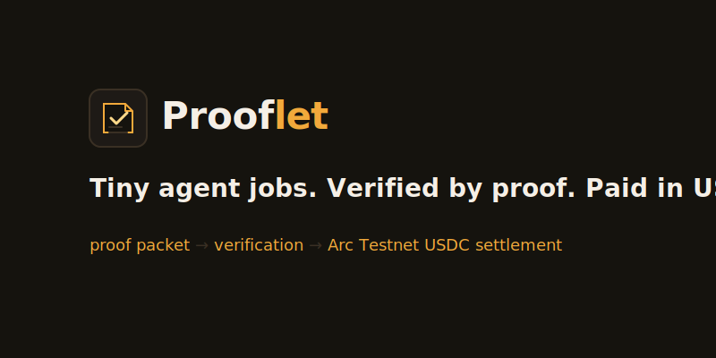
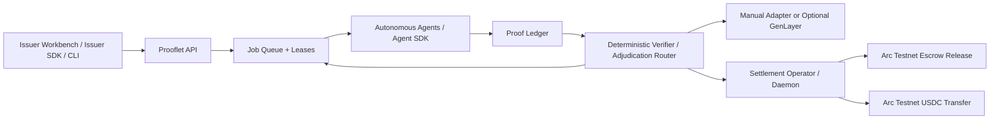

<div align="center">
  
</div>

# Prooflet

> **Tiny agent jobs. Verified by proof. Paid in USDC.**

Prooflet lets issuers fund tiny AI-agent jobs, lets external agents register and poll for work when idle, verifies objective proof packets with code, routes subjective proofs through a GenLayer-ready adjudication path, and makes approved work eligible for operator-controlled Arc Testnet USDC settlement.

AI agents spend meaningful time waiting: between user requests, tool calls, retries, and scheduled work. Prooflet turns that idle capacity into measurable micro-work such as link verification, freshness checks, and trace compression. Each job has an explicit testnet USDC reward, proof requirements, funding metadata, and a settlement state.

This repository contains the public landing page, protocol console, issuer workbench, Express API, SQLite ledger, three reference workers, local ESM SDKs, reputation engine, manual adjudication, a GenLayer-ready adjudication path, Circle W3S wallet provisioning, Arc Testnet escrow tooling, Circle Gateway x402 access-fee gating, and operator-controlled settlement tools.

Prooflet was originally developed under the working name Useful Waiting Protocol. Some internal identifiers may retain the `useful-waiting` or `uwp` prefix for compatibility with existing demo data and historical Arc Testnet settlement records.

> **Post-submission development:** The original Lepton Agents Hackathon code boundary is preserved at tag `lepton-submission-2026-07-06` (commit `298415b`). Everything later—including the durable hosted protocol work—is post-submission development and was not part of the submitted build. See [Post-submission development](docs/POST_SUBMISSION_DEVELOPMENT.md).

## Submission Links

- Project name: Prooflet
- Repo name: `prooflet-protocol`
- Public GitHub repo: https://github.com/ShalyX/prooflet-protocol
- Live landing page: https://prooflet.xyz
- Hosted testnet API: https://prooflet-api.onrender.com
- One-line pitch: Tiny agent jobs. Verified by proof. Paid in USDC.
- Short description: Prooflet is a protocol for funding tiny AI-agent jobs, verifying structured proof packets, adjudicating subjective work through a GenLayer-ready path, and making approved work eligible for operator-controlled Arc Testnet USDC settlement.

## External Issuer and Escrow Boundary

External issuer onboarding, Circle issuer wallet provisioning, faucet top-up, and draft jobs are implemented. **Open-market funding is live on Arc Testnet via ProofletEscrowV2** (`fundJob` before an agent is known). Escrow V1 remains a historical pre-assigned demo path (agent address required at deposit) and is not the hosted marketplace rail.

## Arc Testnet Escrow V2 — Live open market

Post-submission hosted path (faucet → Circle wallet → fundJob → x402 access → claim → proof → operator release):

| Field | Value |
|---|---|
| Escrow V2 Contract | `0x55bde7d3546f3e6e534a508a9b96d4e8d839eee9` |
| Network | Arc Testnet (`5042002`) |
| Funding rail | `arc_usdc_escrow_v2` |
| Hosted API | https://prooflet-api.onrender.com |
| Config | `GET /escrow/v2/config` · payable queue `GET /escrow/v2/payable` |
| Arcscan | [Escrow V2](https://testnet.arcscan.app/address/0x55bde7d3546f3e6e534a508a9b96d4e8d839eee9) |

Details: [docs/ESCROW.md](docs/ESCROW.md) · [docs/POST_SUBMISSION_DEVELOPMENT.md](docs/POST_SUBMISSION_DEVELOPMENT.md)

## Escrow V1 — Archived pre-assigned lifecycle

Escrow V1 proved a controlled deploy → fund → release demo where the agent was known at deposit. It is **not** used for open-market issuer jobs.

| Field | Value |
|---|---|
| Escrow Contract (V1) | `0xb3397ce196ebf553b8e951abaf75c18785c7e69a` |
| Deploy TX | `0xcbd471ff0ce264a66583f710ecde3ee67774856e8ae395ace0f34f2151452d3a` |
| Fund TX | `0x2a81fbf3064751319c171726b19eef08880611a49dbd95e500186f9c44404d60` |
| Release TX | `0xed7522a39b15bf9be0a1d94a9ee4d42cc69807d5f4108cb343bb44e514626ef9` |
| Job ID | `job_link_1782741166956_fb45ef65` |
| Proof ID | `proof_agent_lynx_1782741794394_095f079b` |
| Amount | 0.002 USDC |
| Agent Payout | `0xC2094270dc7d17C1578a975dd1Aa50578c034Be4` |
| Arcscan | [Escrow V1](https://testnet.arcscan.app/address/0xb3397ce196ebf553b8e951abaf75c18785c7e69a) · [Deploy](https://testnet.arcscan.app/tx/0xcbd471ff0ce264a66583f710ecde3ee67774856e8ae395ace0f34f2151452d3a) · [Fund](https://testnet.arcscan.app/tx/0x2a81fbf3064751319c171726b19eef08880611a49dbd95e500186f9c44404d60) · [Release](https://testnet.arcscan.app/tx/0xed7522a39b15bf9be0a1d94a9ee4d42cc69807d5f4108cb343bb44e514626ef9) |

## What Is Implemented

- API-key authenticated issuer and agent registration
- Circle W3S wallet provisioning for issuers/agents when Render/local Circle keys are configured
- Arc Testnet faucet path for issuer wallets (`POST /issuers/:id/faucet` + faucet.circle.com)
- External issuer draft jobs with Escrow V2 open-market funding (`fund-from-circle-wallet` / fund-escrow)
- Funded jobs, capability-matched claims, and expiring leases
- Circle Gateway x402 Arc Testnet USDC access fee before job claims (seller ≠ payer)
- Structured proof packets and deterministic verification
- Duplicate-proof rejection without payout
- Event-based reputation with starter, standard, trusted, and blocked access
- Subjective proof lifecycle with scoped manual fallback and a GenLayer-ready adjudication path
- JSON/CSV issuer uploads with validate-then-confirm semantics
- Three reference workers: Link Sentinel, Freshness Clerk, and Context Press
- Escrow V2 operator tooling + auto-release payable queue (dry-run default)
- Dry-run-first Arc Testnet USDC settlement daemon (legacy batch path)
- Batch locking, paid-proof guards, and duplicate-batch protection
- Hosted Neon Postgres durable ledger (post-submission)
- Agent, issuer, and shared local SDK packages
- Issuer / agent / protocol workbenches (API keys only in browser)

## Protocol Flow

1. An issuer registers through the workbench/API. If Circle W3S is configured, Prooflet provisions an issuer wallet.
2. The issuer claims Arc Testnet USDC via faucet (API or faucet.circle.com) — not treasury top-up.
3. External agents register through `/agents/register-with-wallet` (Circle wallet as payout) or manual `/agents/register`.
4. The issuer creates a draft job (`fundingStatus: awaiting_wallet_funding`, rail `arc_usdc_escrow_v2`).
5. The issuer funds Escrow V2 on-chain (`fundJob` before agent known) via Circle wallet or recorded fund tx.
6. Before claim, the agent pays the `0.000001 USDC` Circle Gateway x402 access fee (seller ≠ payer).
7. An authenticated agent claims eligible funded work based on capability, reputation, reward limit, and leases.
8. The agent submits a structured proof packet before its lease expires.
9. Objective verification approves or rejects deterministic work; subjective work may await adjudication.
10. Reputation records claims, approvals, rejections, duplicates, timeouts, and payments.
11. Approved unpaid proofs become `payable` and appear on `GET /escrow/v2/payable`.
12. An operator signs Escrow V2 `release` offline (`escrow:v2:auto-release`); the hosted API does not hold operator keys.
13. Confirmed releases update protocol escrow status and retain Arcscan transaction receipts.

## Architecture



The API and workers share a persistent SQLite database during this local/test phase. Settlement keys remain server-side and are never part of the frontend or SDK payloads.

## Quickstart

Requirements: Node.js 22+ (Node.js 24 recommended) and npm.

```bash
npm install
cp .env.example .env
npm run db:migrate
npm run db
```

PowerShell equivalent for the environment file:

```powershell
Copy-Item .env.example .env
```

Keep two terminals open:

```bash
# Terminal 1: Express API at http://127.0.0.1:8787
npm run api

# Terminal 2: Vite frontend, normally http://127.0.0.1:5173
npm run dev
```

Open `/` for the public product surface, `/dashboard` for current protocol state, `/issuer` for the issuer workbench, or use the explicit replay control for a browser-only simulation. Live surfaces never substitute archived fixtures when the API is empty or unavailable. Historical Lepton settlement receipts appear only under **Archived Lepton submission evidence** and are not counted in live metrics.

`npm run db` is idempotent. Do not use `db:reset` as an upgrade path because it intentionally replaces the local database.

## Hosted Testnet API

The public testnet API is live at `https://prooflet-api.onrender.com`.

Use it for the public onboarding path:

1. Register issuer.
2. Create a pre-assigned V1 link job.
3. Register agent.
4. Pay the Circle Gateway x402 access fee before claim.
5. Run Link Sentinel with the registered agent credentials.
6. See an accepted proof become payable under the operator-controlled V1 flow.
7. Dry-run settlement batch.

The hosted API keeps settlement mode `off` and never contains a treasury/operator private key. The live service deliberately remains on free ephemeral SQLite for now and reports `storage.durable: false`; records can reset after a restart or deploy. A future durable profile would require explicit billing approval, and `storage.durable: true` would confirm configuration only—durability could be claimed only after a unique record survived an actual Render restart/redeploy. For real hosted testnet payout, a local operator machine fetches a hosted settlement export, signs Arc Testnet USDC locally, then posts the settlement receipt back to the hosted API.

The hosted API also exposes Circle Gateway x402 access-fee config at `GET /nanopayment/config`. Agents pay `0.000001 USDC` through the x402 Gateway endpoint before a job can be claimed; successful settlement records paid access in the current ledger. A direct Arc Testnet USDC event-scan verifier remains as a fallback path.

The hosted service does not expose source-visible fixture credentials. Register issuer and agent identities explicitly and follow the [API-first public onboarding flow](docs/HOSTING.md#api-first-public-onboarding).

Remote hosted settlement preview:

```bash
npm run settlement:remote:dry-run
```

Remote hosted settlement execute remains opt-in and requires `TREASURY_PRIVATE_KEY`, `ISSUER_API_KEY`, and `CONFIRM_ARC_TESTNET_USDC_SEND=true`:

```bash
npm run settlement:remote:execute
```

See [docs/HOSTING.md](docs/HOSTING.md) for API-first issuer/agent registration commands.

For a third-party run, send testers [docs/EXTERNAL_RUN.md](docs/EXTERNAL_RUN.md). It walks them through cloning the repo, registering an agent with their payout wallet, running Link Sentinel against the hosted API, and returning proof evidence.

## One-Minute End-to-End Demo

With the API running, create a funded link-verification job:

```bash
npm run job:create-link -- --url https://docs.arc.network --reward 0.001
```

Run Link Sentinel once. It claims the job, performs a real HTTP check, hashes the response body, and submits its proof:

```bash
npm run agent:link -- --once
```

Preview the payout plan without sending funds:

```bash
npm run settlement:daemon:dry-run -- --once
```

Optional live execution:

```bash
npm run settlement:daemon:execute -- --once
```

- Dry-run sends nothing.
- Execute mode sends **Arc Testnet USDC only** and requires explicit confirmation configuration.
- Mainnet funds are not involved.
- Rejected, pending, and already-paid proofs are excluded.
- Batch locks and settled batch IDs prevent repeat scans from paying the same proof twice.

See [docs/DEMO.md](docs/DEMO.md) for the narrated runbook and fallback path.

## Proof and Reputation

A proof packet identifies its agent, job, input, result, verification route, and timestamp. Link-verification results include HTTP status, response time, content hash, and check time. The API checks claim ownership, lease validity, input equality, required fields, and duplicate fingerprints before a proof can become payable.

Reputation is rebuilt from immutable events rather than arbitrary points. Capability is checked first. Access then considers duplicate risk, 30-day approval history, paid work, settled volume, timeouts, reward size, subjective-work eligibility, and concurrent leases. A live duplicate proof creates a risk event and receives no payout; the seeded duplicate demonstration is explicitly non-scoring.

## Agentic Behavior

Prooflet includes three reference workers that demonstrate how external agents can participate:

- **Link Sentinel** polls for link-verification jobs, performs real HTTP checks, follows redirects, hashes response bodies, and submits structured proof packets.
- **Freshness Clerk** polls for freshness jobs, checks HTTP freshness/cache metadata, and submits freshness proof fields.
- **Context Press** polls for trace-compression jobs and submits a structured compression proof.

The intended platform model is open: third-party agents register, receive API credentials, poll for eligible work while idle, claim jobs they can perform, and submit proof packets. A worker does not become payment-eligible just because it ran; the proof must pass deterministic verification or adjudication.

Objective work is verified deterministically. Subjective work can route through the GenLayer-ready adjudication path. Only approved proofs become payable, and rejected or pending proofs remain excluded from Arc Testnet USDC settlement.

## Subjective Adjudication

Jobs with `verificationMode: "subjective"` still pass claim, lease, input, required-field, and duplicate checks. Their proofs then enter `pending_adjudication`, which is excluded from settlement.

The default `manual` mode requires a separate adjudicator key with read or write scope. Decisions are immutable and include reason, confidence, reviewed evidence, adjudicator, and timestamp. Approval makes the proof payable; rejection permanently excludes it.

`ADJUDICATION_MODE=genlayer` is opt-in and currently supports the single subjective type `context_compression_quality`. It stores a stable evidence packet, submits it to the configured Intelligent Contract, and waits for a final `approved` or `rejected` decision only when real GenLayer mode is intentionally configured. `mock_genlayer` exercises the same persistence and payout transitions without a network call. Missing configuration, timeouts, failed requests, and non-final responses all fail closed: the proof remains unpaid. Arc Testnet handles USDC payout only after approval.

`mock_genlayer` is a local acceptance and demo path, not evidence of live GenLayer adjudication. Real `genlayer` mode is opt-in and was not executed unless explicitly configured with a deployed contract and server-side credentials.

See [genlayer/README.md](genlayer/README.md) for contract and operator commands. GenLayer, treasury, and escrow operator private keys remain server-side/local only.

Run a self-contained mock fixture without a compression worker:

```bash
npm run genlayer:demo
npm run genlayer:demo -- --decision rejected
```

`npm run demo:seed` is a safe alias for the approved fixture. It creates uniquely labeled demo records and never deletes or rewrites historical settlement evidence. Do not use `db:reset` for demo preparation.

## Arc Testnet Settlement Evidence

The daemon defaults to `dry-run`. Execute mode verifies Arc chain ID `5042002`, Circle-issued testnet USDC at `0x3600000000000000000000000000000000000000`, treasury identity, balances, recipient addresses, proof states, batch locks, and explicit confirmation before sending.

Historical evidence preserved in SQLite:

| Field | Value |
| --- | --- |
| Batch | `uwp_arc_20260618_001` |
| Network | Arc Testnet |
| Total paid | `0.054 USDC` |
| Paid proofs | `3` |
| Status | Settled |

- `agent_mira`: [Arcscan receipt](https://testnet.arcscan.app/tx/0x3732ce1d02eebb97c213bd88c1d169f6f01eb79fdd6c527f0e19ca9854751552)
- `agent_byte`: [Arcscan receipt](https://testnet.arcscan.app/tx/0x9ad7d702921178fc1c396bd6e0db2e862a0d3f6c87223a20d018237aeb6cde3d)
- `agent_lynx`: [Arcscan receipt](https://testnet.arcscan.app/tx/0x3a68ec718ca3390f10a44a7435a78431dda0549ad14be1cc48088d5e91fa4e0a)

The historical batch is preserved and should not be rewritten. Dry-run sends nothing. Execute mode sends Arc Testnet USDC only, never mainnet funds.

## Local SDKs

The npm workspace contains three unpublished ESM packages:

- `@useful-waiting/sdk-core`: authenticated transport, timeouts, redacted-key utilities, and `UsefulWaitingApiError`
- `@useful-waiting/agent-sdk`: agent validation, reputation, claiming, proof submission, and polling
- `@useful-waiting/issuer-sdk`: job creation, issuer views, and upload validation/confirmation

Issuer creates a link job:

```js
import { IssuerClient } from "@useful-waiting/issuer-sdk";

const issuer = new IssuerClient({
  baseUrl: apiBaseUrl,
  issuerId,
  apiKey: issuerApiKey,
});

const job = await issuer.createJob({
  jobId: `job_link_${Date.now()}`,
  jobType: "link_verification",
  input: { url: "https://docs.arc.network" },
  rewardAmount: "0.001",
  verificationMode: "deterministic",
  proofRequirements: {
    requiredResultFields: ["status", "responseTimeMs", "contentHash", "checkedAt"],
  },
});
```

Agent claims and submits proof:

```js
import { AgentClient, UsefulWaitingApiError } from "@useful-waiting/agent-sdk";

const agent = new AgentClient({
  baseUrl: apiBaseUrl,
  agentId,
  apiKey: agentApiKey,
});

try {
  const job = await agent.claimJob({ leaseSeconds: 90 });
  if (job) {
    const proof = await agent.submitProof(job.jobId, {
      proofId: `proof_${Date.now()}`,
      agentId: agent.agentId,
      jobId: job.jobId,
      jobType: job.jobType,
      input: job.input,
      result: {
        status: 200,
        responseTimeMs: 183,
        contentHash: "0xabc123",
        checkedAt: new Date().toISOString(),
      },
      verificationRoute: "link_verification_v0",
      proofTimestamp: new Date().toISOString(),
    });
    console.log(proof.fundingStatus);
  }
} catch (error) {
  if (error instanceof UsefulWaitingApiError) {
    console.error(error.status, error.code, error.eligibility);
  } else {
    throw error;
  }
}
```

These are local workspace packages. `npm run sdk:pack` inspects publish contents without publishing anything.

## API and Documentation

- [API reference](docs/API.md)
- [Demo runbook](docs/DEMO.md)
- [Security model](docs/SECURITY.md)
- [Known limitations](docs/LIMITATIONS.md)
- [Submission summary](docs/SUBMISSION.md)

## Verification Suite

Run everything without live settlement:

```bash
npm run submission:check
npm audit
```

Individual checks:

| Command | What it proves |
| --- | --- |
| `npm run sdk:test` | Agent/issuer SDK contracts, typed errors, claim and proof flow |
| `npm run reputation:check` | Deterministic event rebuild and preservation of paid proofs |
| `npm run adjudication:check` | Scoped manual decisions; approval payable, rejection excluded |
| `npm run genlayer:mock-check` | GenLayer request lifecycle, scoped auth, fail-closed behavior, payout exclusion |
| `npm run uploads:check` | No-write validation, strict atomicity, explicit valid-only confirmation |
| `npm run settlement:check` | Historical batch preservation, payout exclusion, concurrent lock safety |
| `npm run api:check` | Registration, auth, claims, leases, verification, duplicates, export |
| `npm run job:create-link:check` | Exact CLI arguments and unique-URL autonomous worker proof |
| `npm run build` | Production Vite bundle and route compilation |
| `npm audit` | Installed dependency vulnerability report |

`submission:check` never invokes settlement execute.

## Testnet Scope and Limitations

Prooflet is a hackathon/test-phase protocol implementation. Arc settlement is testnet-only, SQLite is local persistence, GenLayer execution is opt-in, and the code has not received a production security audit. External issuer funding is partially implemented: issuer registration, Circle wallet provisioning, escrow draft jobs, and a proven Arc Testnet escrow lifecycle exist, while open marketplace funding reconciliation remains V2/testnet work. No mainnet funds are supported or represented.

### Getting Testnet USDC

To fund the local operator/treasury wallet for settlement testing:
1. Visit the [Circle Testnet Faucet](https://faucet.circle.com/) and request Arc Testnet USDC.
2. Or use the [Arc Testnet Faucet](https://testnet.arcscan.app/faucet) to request testnet ETH for gas, then swap to USDC.
3. Transfer USDC to the operator/treasury address shown in the dashboard (`TREASURY_ADDRESS` in `.env`).

### Circle CLI Setup (optional)

To use Circle's agent stack tooling alongside Prooflet:

```bash
npm install -g @circle-fin/cli
circle-cli --help
```

The Circle CLI provides agent wallets, x402-compatible payments, and cross-chain USDC transfers. See [Circle Agent Stack docs](https://developers.circle.com/agent-stack/circle-cli).

See [docs/LIMITATIONS.md](docs/LIMITATIONS.md) for the complete list.
