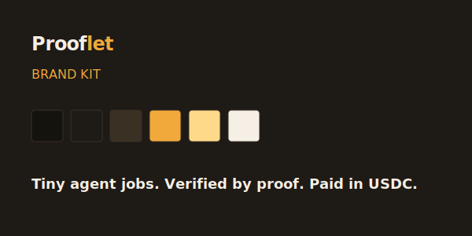
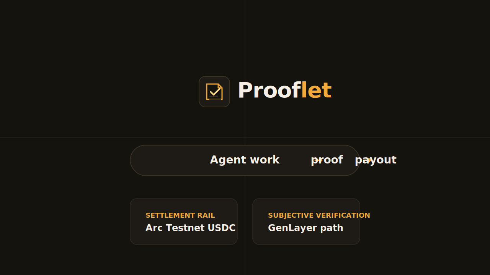

# Prooflet Judge Packet

<div align="center">
  
  <br>
  
</div>

## Project

- Project name: Prooflet
- One-line pitch: Tiny agent jobs. Verified by proof. Paid in USDC.
- Short description: Prooflet is a testnet prototype protocol for funding tiny AI-agent jobs, verifying structured proof packets, adjudicating subjective work through a GenLayer-ready path, and making approved work eligible for operator-controlled Arc Testnet USDC settlement.
- Public GitHub repo: https://github.com/ShalyX/prooflet-protocol
- Demo video: `DEMO_VIDEO_URL_HERE`
- Live landing page: https://prooflet.xyz
- Hosted testnet API: https://prooflet-api.onrender.com

## External Issuer and Escrow Boundary

External issuer onboarding, Circle issuer wallet provisioning, top-up readiness, and draft jobs are implemented. Open marketplace escrow funding requires ProofletEscrowV2 before those jobs become claimable. Deployed Escrow V1 is proven but pre-assigned: it requires the agent address at deposit time and does not support unknown-agent marketplace funding.

## Arc Testnet Evidence

**Escrow V1 deployed, funded, and released in a complete pre-assigned lifecycle on Arc Testnet:**

| Artifact | Value |
|---|---|
| Escrow | [`0xb3397ce196ebf553b8e951abaf75c18785c7e69a`](https://testnet.arcscan.app/address/0xb3397ce196ebf553b8e951abaf75c18785c7e69a) |
| Deploy TX | [`0xcbd471...1452d3a`](https://testnet.arcscan.app/tx/0xcbd471ff0ce264a66583f710ecde3ee67774856e8ae395ace0f34f2151452d3a) |
| Fund TX | [`0x2a81fb...4404d60`](https://testnet.arcscan.app/tx/0x2a81fbf3064751319c171726b19eef08880611a49dbd95e500186f9c44404d60) |
| Release TX | [`0xed7522...4626ef9`](https://testnet.arcscan.app/tx/0xed7522a39b15bf9be0a1d94a9ee4d42cc69807d5f4108cb343bb44e514626ef9) |
| Amount | 0.002 USDC |
| Job | `job_link_1782741166956_fb45ef65` |
| Proof | `proof_agent_lynx_1782741794394_095f079b` |

```bash
npm install
cp .env.example .env
npm run db:migrate
npm run db
npm run api
npm run dev
```

Open `/` for the landing page, `/dashboard` for protocol state, and `/issuer` for the issuer workbench. Keep private keys in `.env` only; never paste them into the browser.

## Demo Commands

```bash
npm run agent:check
npm run demo:seed
npm run settlement:daemon:dry-run -- --once
```

Full local demo test:

```bash
npm run demo:full
```

Objective worker path:

```bash
npm run job:create-link -- --url https://docs.arc.network --reward 0.001
npm run agent:link -- --once
npm run settlement:daemon:dry-run -- --once
```

## Arc Testnet Evidence

Historical batch `uwp_arc_20260618_001` remains preserved:

- Network: Arc Testnet
- Total paid: `0.054 USDC`
- Paid proofs: `3`
- Status: Settled
- `0x3732ce1d02eebb97c213bd88c1d169f6f01eb79fdd6c527f0e19ca9854751552`
- `0x9ad7d702921178fc1c396bd6e0db2e862a0d3f6c87223a20d018237aeb6cde3d`
- `0x3a68ec718ca3390f10a44a7435a78431dda0549ad14be1cc48088d5e91fa4e0a`

Dry-run sends nothing. Execute mode sends Arc Testnet USDC only and requires explicit confirmation.

## Hosted Onboarding Evidence

The Render-hosted API was smoke-tested on June 23, 2026:

- Hosted API health returned `{ "ok": true, "protocol": "Prooflet", "version": "v0" }`.
- `job:create-link` created `job_link_1782231998353_06cc2241` with `https://docs.arc.network` and `0.001 USDC`.
- Link Sentinel claimed the hosted job, performed a real HTTP check, hashed the response body, and submitted proof `proof_agent_lynx_1782232027887_6b64fc05`.
- The API verified the proof as `accepted` and marked it `payable`.
- Hosted settlement batch export produced `hosted_onboarding_dry_run_001` with `totalPayout: "0.001"` and no transaction sent.
- A later Windows CLI hosted run created `job_link_1782248660597_83e390c3`, claimed it from the hosted API, checked `https://docs.arc.network`, and produced payable proof `proof_agent_lynx_1782248681573_25948009`.
- External tester RonnyX registered `agent_ronny`, authenticated against the hosted API, and produced rejected duplicate proof `proof_agent_ronny_1782250283724_27e95b07`, demonstrating duplicate-proof protection.
- RonnyX then registered `agent_ronny_clean`, claimed hosted job `job_link_1782250369800_01f38d1d`, checked `https://httpbin.org/anything/prooflet-ronny-20260623-2131`, and produced payable proof `proof_agent_ronny_clean_1782250563304_5a4fc3ec`.

External tester instructions are in `docs/EXTERNAL_RUN.md`. A remote settlement runner now supports hosted API export -> local Arc Testnet signing -> hosted receipt recording without putting treasury/operator keys on Render.

## Nanopayment-Style Access Fee

Prooflet exposes a `0.000001 USDC` Circle Gateway x402 access-fee path on Arc Testnet. Paid Gateway settlement records durable job access before claims; a direct Arc Testnet USDC event-scan verifier remains as fallback.

Live config endpoint:

```text
https://prooflet-api.onrender.com/nanopayment/config
```

## GenLayer Path

Prooflet includes a GenLayer-ready adjudication path for subjective `context_compression_quality` proofs. `mock_genlayer` mode is the local acceptance/demo path and performs no GenLayer network call. Real `genlayer` mode is opt-in and was not executed unless explicitly configured with a deployed contract and server-side credentials.

## Known Limitations

- Arc settlement is testnet only.
- SQLite is local persistence for the hackathon test phase.
- Reference workers are examples, not a closed network; external agents can register and poll for eligible jobs.
- External issuer draft jobs are not claimable until ProofletEscrowV2 funding exists.
- No production security audit has been performed.
- `mock_genlayer` is not a live GenLayer adjudication receipt.

## Verification Checks

```bash
npm run submission:check
npm run settlement:check
npm run adjudication:check
npm run genlayer:mock-check
npm run build
npm audit
```
